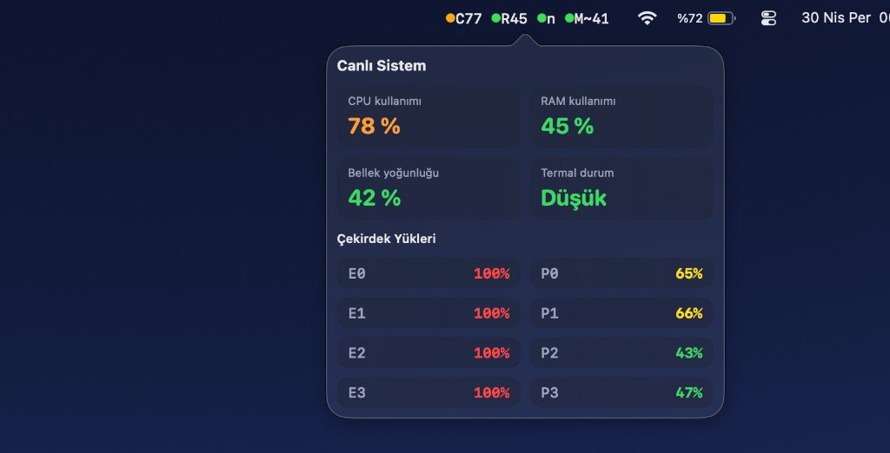

# MenuBarMonitor

**Türkçe:** [Read the README in Turkish](README.md)

MenuBarMonitor is a lightweight system monitor for the macOS menu bar.
It shows live CPU, RAM, thermal state, and memory pressure at a glance.



## Who is it for?

- Anyone who wants a quick read of system load from the menu bar
- Anyone who wants CPU/RAM/thermal status without opening Activity Monitor
- Anyone looking for a simple menu bar utility that does not appear in the Dock (`LSUIElement`)

## Features

- macOS application icon: bundle icon in Finder, Login Items, and similar (`Assets.xcassets` → `AppIcon`)
- Short live label in the menu bar: `Cxx Ryy n M~zz`
- Colored status dots
- Left click: detail panel
- Right click:
  - Launch at login (login item)
  - Quit
- Follows system language: Turkish and English UI strings (`Localizable.strings`)
- E‑ and P‑cluster loads on separate lines in the detail view
- Samples about every 3 seconds

## What does the menu bar label mean?

- `C`: overall CPU usage percentage
- `R`: RAM usage percentage
- `n/f/s/k`: thermal state
  - `n`: nominal
  - `f`: fair
  - `s`: serious
  - `k`: critical
- `M~`: memory pressure proxy (not real DRAM bandwidth)

## Project layout (summary)

- `MenuBarMonitor/` — Swift sources, `Info.plist`, localization (`*.lproj`)
- `MenuBarMonitor/Assets.xcassets` — `AppIcon.appiconset` (16–512 pt @1x/@2x PNG set for macOS)
- `MenuBarMonitor.xcodeproj` — Xcode project

To change the icon design, update the images in `AppIcon.appiconset` and rebuild; Xcode produces `AppIcon.icns` and `Assets.car`.

## Quick start

### Option 1: Download from GitHub and run in Xcode

1. Open the repo: [MenuBarMonitor](https://github.com/kuarezma/MenuBarMonitor)
2. Click the green `Code` button
3. Choose `Download ZIP`
4. Unzip the archive
5. Double‑click `MenuBarMonitor.xcodeproj`
6. In Xcode, select `My Mac` (or your Mac) as the run destination
7. Press `Run` (or `Cmd + R`)

### Option 2: Clone and build from Terminal

```bash
git clone https://github.com/kuarezma/MenuBarMonitor.git
cd MenuBarMonitor
xcodebuild -project "MenuBarMonitor.xcodeproj" \
  -scheme "MenuBarMonitor" \
  -configuration Release \
  -derivedDataPath "/tmp/MenuBarMonitor-DD" build
```

If you are not on Apple Silicon or you get a `destination` error, add this line to the command above: `-destination 'platform=macOS,arch=arm64,name=My Mac'`

Built app path:

- `/tmp/MenuBarMonitor-DD/Build/Products/Release/MenuBarMonitor.app`

Copy to Desktop and open:

```bash
rm -rf "$HOME/Desktop/MenuBarMonitor.app"
ditto "/tmp/MenuBarMonitor-DD/Build/Products/Release/MenuBarMonitor.app" "$HOME/Desktop/MenuBarMonitor.app"
open "$HOME/Desktop/MenuBarMonitor.app"
```

## Requirements

- macOS 14 or later
- Xcode (full install from the App Store)

## Everyday use

- Left click: toggle the detail panel
- Right click: launch at login + quit
- The app does not show in the Dock; it lives in the menu bar

## Sharing the `.app` safely (release)

The included script in one step:

- Builds a Release app
- Zips the `.app`
- Writes a SHA256 checksum file
- Optionally creates a GitHub Release if `gh` is installed and logged in

Command:

```bash
./scripts/release.sh v1.0.0
```

Artifacts:

- `build/releases/v1.0.0/MenuBarMonitor-v1.0.0.zip`
- `build/releases/v1.0.0/MenuBarMonitor-v1.0.0.zip.sha256.txt`

Verify the checksum (for downloaders):

```bash
shasum -a 256 MenuBarMonitor-v1.0.0.zip
```

Compare the output with the value in the `.sha256.txt` file.

## FAQ / troubleshooting

### “Cannot open” or permission warnings

- macOS may show a security prompt the first time you open the app.
- If needed, allow it under `System Settings > Privacy & Security`.

### After reboot, CPU looks high for a while — is that normal?

- Usually yes.
- Post‑login tasks (Spotlight, iCloud, Photos analysis, etc.) can create short spikes.

### Why no real temperature (°C) or fixed GHz?

- This app does not read °C directly from SMC sensors.
- Reliable per‑core live frequency from user space is limited on Apple Silicon.
- The UI prefers trustworthy metrics over misleading numbers.

## Contributing

Pull requests and issues are welcome. Small improvements, UI tweaks, and accuracy feedback are appreciated.
