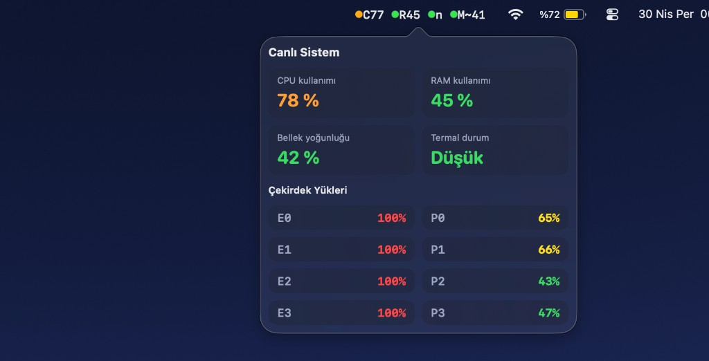

# MenuBarMonitor

MenuBarMonitor, macOS menü çubuğunda çalışan hafif bir sistem izleyicisidir.
CPU, RAM, termal durum ve bellek yoğunluğu bilgisini canlı gösterir.



## Kimler İçin?

- Mac'inin anlık yükünü üst bardan hızlıca görmek isteyenler
- Activity Monitor açmadan CPU/RAM/termal durumu takip etmek isteyenler
- Basit, Dock'ta görünmeyen (`LSUIElement`) bir menü bar aracı arayanlar

## Özellikler

- Menü çubuğunda kısa canlı etiket: `Cxx Ryy n M~zz`
- Renkli durum noktaları
- Sol tık ile detay paneli
- Sağ tık ile:
  - `Otomatik açıl` (login item)
  - `Çık`
- Sistem dili algılama: Türkçe ve İngilizce arayüz metinleri (`Localizable.strings`)
- E/P çekirdek yüklerini ayrı satırlarda görüntüleme
- 3 saniyede bir yenilenen örnekleme

## Menü Etiketi Ne Anlama Geliyor?

- `C`: toplam CPU kullanım yüzdesi
- `R`: RAM kullanım yüzdesi
- `n/f/s/k`: termal durum
  - `n`: nominal
  - `f`: fair
  - `s`: serious
  - `k`: critical
- `M~`: bellek yoğunluğu vekili (gerçek DRAM bant genişliği değildir)

## Hızlı Başlangıç (Hiç Bilmeyenler İçin)

### Seçenek 1: GitHub'dan indirip Xcode ile çalıştır

1. Bu repoya gir: [MenuBarMonitor](https://github.com/kuarezma/MenuBarMonitor)
2. Yeşil `Code` butonuna tıkla
3. `Download ZIP` seç
4. ZIP dosyasını aç
5. `MenuBarMonitor.xcodeproj` dosyasına çift tıkla
6. Xcode açılınca üstte hedef olarak `My Mac` seçili olsun
7. `Run` (veya `Cmd + R`) ile çalıştır

### Seçenek 2: Terminal ile klonla ve derle

```bash
git clone https://github.com/kuarezma/MenuBarMonitor.git
cd MenuBarMonitor
xcodebuild -project "MenuBarMonitor.xcodeproj" \
  -scheme "MenuBarMonitor" \
  -configuration Release \
  -destination "platform=macOS,arch=arm64,name=My Mac" \
  -derivedDataPath "/tmp/MenuBarMonitor-DD" build
```

Derlenen uygulama:

- `/tmp/MenuBarMonitor-DD/Build/Products/Release/MenuBarMonitor.app`

Masaüstüne kopyalayıp başlatmak için:

```bash
rm -rf "$HOME/Desktop/MenuBarMonitor.app"
ditto "/tmp/MenuBarMonitor-DD/Build/Products/Release/MenuBarMonitor.app" "$HOME/Desktop/MenuBarMonitor.app"
open "$HOME/Desktop/MenuBarMonitor.app"
```

## Gereksinimler

- macOS 14 veya üzeri
- Xcode (tam kurulum, App Store sürümü)

## Günlük Kullanım

- Sol tık: detay panelini aç/kapat
- Sağ tık: otomatik açıl seçeneği + çıkış
- Uygulama Dock'ta görünmez; menü çubuğunda çalışır

## .app Dosyasını Güvenli Paylaşma (Release)

Projede hazır gelen script ile tek komutta:

- Release build alır
- `.app` dosyasını zipler
- SHA256 checksum üretir
- `gh` girişiniz varsa GitHub Release'e yükler

Komut:

```bash
./scripts/release.sh v1.0.0
```

Üretilen dosyalar:

- `build/releases/v1.0.0/MenuBarMonitor-v1.0.0.zip`
- `build/releases/v1.0.0/MenuBarMonitor-v1.0.0.zip.sha256.txt`

Checksum doğrulama (indiren kullanıcı için):

```bash
shasum -a 256 MenuBarMonitor-v1.0.0.zip
```

Çıktıyı `.sha256.txt` içindeki değerle karşılaştırın.

## Sık Sorulan / Sorun Giderme

### "Açılmıyor" veya "izin" uyarısı alıyorum

- Uygulamayı ilk açışta macOS güvenlik uyarısı verebilir.
- Gerekirse `System Settings > Privacy & Security` altında açılmasına izin verin.

### Yeniden başlatınca CPU bir süre yüksek görünüyor, normal mi?

- Evet, çoğu zaman normaldir.
- Spotlight, iCloud, Photos analizleri gibi açılış sonrası görevler geçici yük oluşturur.

### Neden gerçek sıcaklık (°C) veya sabit GHz göstermiyor?

- Bu uygulama SMC sensörlerinden direkt °C okumaz.
- Apple Silicon tarafında kullanıcı alanından güvenilir anlık çekirdek frekansı sınırlıdır.
- Bu yüzden yanıltıcı değer üretmek yerine güvenilir metrikler gösterilir.

## Katkı

PR ve issue açabilirsiniz. Küçük iyileştirmeler, UI düzenlemeleri ve ölçüm doğruluğu geri bildirimleri memnuniyetle karşılanır.
